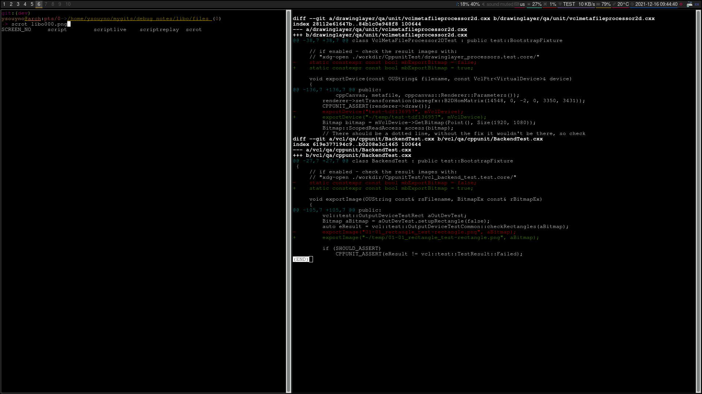
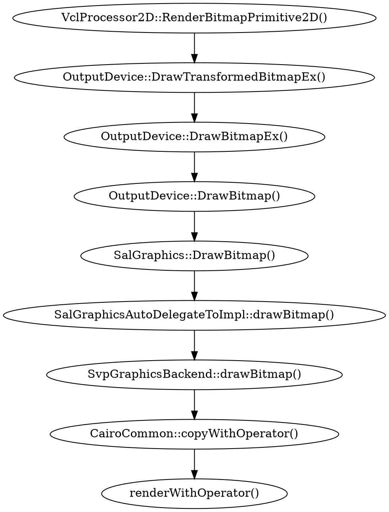
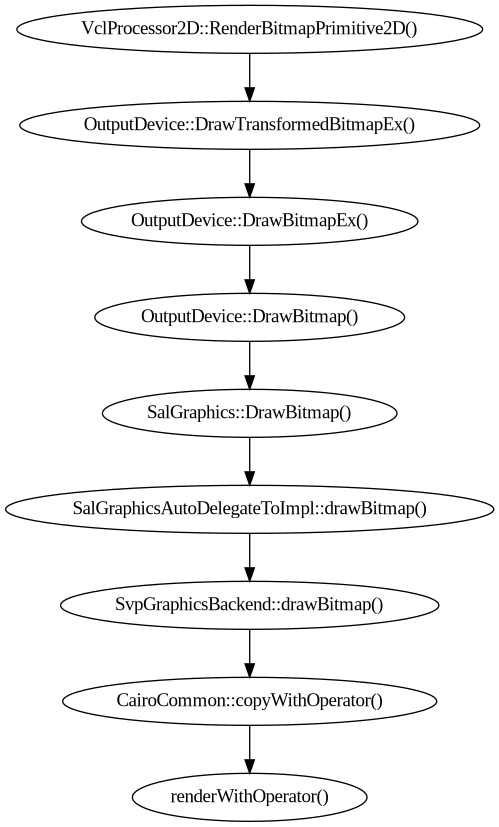
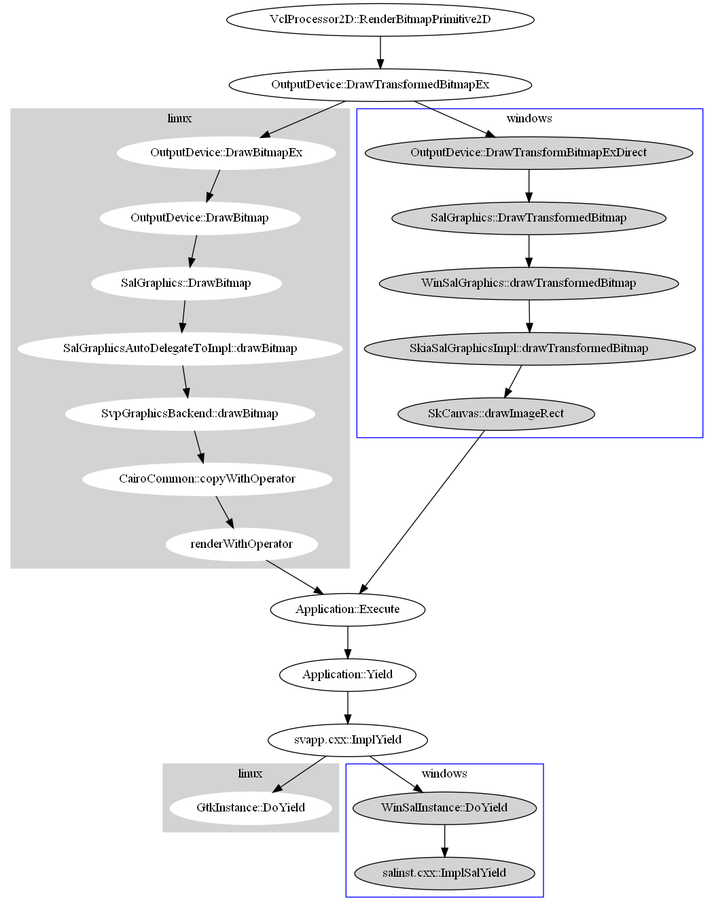

<!-- markdown-toc start - Don't edit this section. Run M-x markdown-toc-refresh-toc -->
**Table of Contents**

- [<2021-12-13 周一> 调试`libo-7.3`的`emf`流程（一）](#2021-12-13-周一-调试libo-73的emf流程一)
- [<2021-12-14 Tue> 调试`libo-7.3`的`emf`流程（二）](#2021-12-14-tue-调试libo-73的emf流程二)
- [<2021-12-15 Wed> 调试`libo-7.3`的`emf`流程（三）](#2021-12-15-wed-调试libo-73的emf流程三)
    - [如何使用`libo`的`cppunit`来调试](#如何使用libo的cppunit来调试)
- [<2021-12-16 Thu> 调试`libo-7.3`的`emf`流程（四）](#2021-12-16-thu-调试libo-73的emf流程四)
- [<2022-08-16 周二> 调试`libo`的图片绘制流程（一）](#2022-08-16-周二-调试libo的图片绘制流程一)
- [<2022-08-19 Fri> 调试`libo`的图片绘制流程（二）](#2022-08-19-fri-调试libo的图片绘制流程二)
- [<2022-08-23 Tue> 调试`libo`的图片绘制流程（三）](#2022-08-23-tue-调试libo的图片绘制流程三)
- [<2022-08-23 周二> 调试`libo`的图片绘制流程（四）](#2022-08-23-周二-调试libo的图片绘制流程四)
- [<2023-09-23 周六> 调试`libo`如果向`windows`剪贴板设置`CF_ENHMETAFILE`数据](#2023-09-23-周六-调试libo如果向windows剪贴板设置cf_enhmetafile数据)
- [<2023-09-24 周日> 调试`libo`如何转化为`EMF`数据](#2023-09-24-周日-调试libo如何转化为emf数据)

<!-- markdown-toc end -->

| PLATFORM | COMMIT/BRANCH                                            | BUILD TIME |
| :-:      | :-:                                                      |        :-: |
| WINDOWS  | 28d43b69651289dca7b62341726ae9771ba30e2c                 | 2021-11-16 |
| LINUX    | 79589afe173ba8f17bfbbc6b38f0dfbc5fd9e0c9                 | 2021-11-13 |
| LINUX    | 364c807cf22de7898e918a9cd1fa7e5392ca7577/libreoffice-7-3 | 2021-12-15 |

``` shellsession
# autogen.lastrun for windows
--with-ant-home=/cygdrive/d/cygwin64/home/user1328/sources/apache-ant-1.9.5
--with-jdk-home=/cygdrive/d/dnld/jdk-11.0.11+9
--enable-pch
--disable-ccache
--disable-odk
--disable-online-update
--without-junit
--enable-dbgutil

# autogen.lastrun for linux
--enable-dbgutil
```

# <2021-12-13 周一> 调试`libo-7.3`的`emf`流程（一）

在`XEmfParser::getDecomposition()`函数中，当读取`emf`文件结束后会调用：

``` c++
// xemfparser.cxx

// ...and create a single MetafilePrimitive2D containing the Metafile.
// CAUTION: Currently, ReadWindowMetafile uses the local VectorGraphicData
// and a MetafileAccessor hook at the MetafilePrimitive2D inside of
// ImpGraphic::ImplGetGDIMetaFile to get the Metafile. Thus, the first
// and only primitive in this case *has to be* a MetafilePrimitive2D.
aRetval.push_back(
    new drawinglayer::primitive2d::MetafilePrimitive2D(
        aMetafileTransform,
        aMtf));
```

此处的代码我觉得比较重要，因为从我目前分析到的流程来看，最终解析出的`emf`信息将会在`SdrPaintView::CompleteRedraw()`函数中通过`BeginCompleteRedraw()`，`DoCompleteRedraw()`和`EndCompleteRedraw()`函数来进行绘制，先看这里的`aRetval`是：

``` c++
class SAL_WARN_UNUSED DRAWINGLAYER_DLLPUBLIC Primitive2DContainer final
    : public std::deque<Primitive2DReference>,
      public Primitive2DDecompositionVisitor
{}

drawinglayer::primitive2d::Primitive2DContainer aRetval;
```

即`aRetval`就是一个`std::deque<Primitive2DReference>`，它的成员都是`Primitive2DReference`类型，这个类型其实就是一个基类指针类型，我看了半天才理清关系。首先看`Primitive2DReference`的定义，它其实就是一个`css::graphic::XPrimitive2D`类型：

``` c++
// CommonTypes.hxx

namespace drawinglayer::primitive2d
{
typedef css::uno::Reference<css::graphic::XPrimitive2D> Primitive2DReference;
typedef css::uno::Sequence<Primitive2DReference> Primitive2DSequence;
} // end of namespace drawinglayer::primitive2d
```

那为什么`aRetval`可以将`MetafilePrimitive2D`类型推进去呢？因为`MetafilePrimitive2D`继承自`BufferedDecompositionPrimitive2D`继承自`BasePrimitive2D`继承自`BasePrimitive2DImplBase`继承自`css::graphic::XPrimitive2D`。

现在再看：

``` c++
void SdrPaintView::DoCompleteRedraw(SdrPaintWindow& rPaintWindow, const vcl::Region& rReg, sdr::contact::ViewObjectContactRedirector* pRedirector)
{
    // redraw all PageViews with the target. This may expand the RedrawRegion
    // at the PaintWindow, plus taking care of FormLayer expansion
    if(mpPageView)
    {
        mpPageView->CompleteRedraw(rPaintWindow, rReg, pRedirector);
    }
}
```

注意上面的第三个参数`ViewObjectContactRedirector`：

``` c++
// viewobjectcontactredirector.hxx

// This class provides a mechanism to redirect the paint mechanism for all or
// single ViewObjectContacts. An own derivation may be set at single ViewContacts
// or at the ObjectContact for redirecting all. If both is used, the one at single
// objects will have priority.
class SVXCORE_DLLPUBLIC ViewObjectContactRedirector
{
public:
    // basic constructor.
    ViewObjectContactRedirector();

    // The destructor.
    virtual ~ViewObjectContactRedirector();

    // all default implementations just call the same methods at the original. To do something
    // different, override the method and at least do what the method does.
    virtual drawinglayer::primitive2d::Primitive2DContainer createRedirectedPrimitive2DSequence(
        const sdr::contact::ViewObjectContact& rOriginal,
        const sdr::contact::DisplayInfo& rDisplayInfo);
};
```

看到它的最后一个虚函数`createRedirectedPrimitive2DSequence()`的返回值是`drawinglayer::primitive2d::Primitive2DContainer`，这样暂时就把上面解析`emf`和这里绘制的代码结合起来了。

# <2021-12-14 Tue> 调试`libo-7.3`的`emf`流程（二）

不知从哪里得到的启示，查看了`libo`关于“[Visual Class Library (VCL)](https://docs.libreoffice.org/vcl.html)”的说明文档，经过半天的尝试，感觉此时我获得了一点用的信息，所以赶紧记录一下。

搞了一个“[run_debug_libo_emf.sh](files/run_debug_libo_emf.sh)”，方便调试：

``` shell
#!/bin/bash

OUT=$HOME/temp/libo_emf.log

export SAL_LOG_FILE=$OUT

if [ -f $OUT ]; then
    rm -f $OUT
    printf "delete: %s\n" $OUT
fi

export SAL_LOG=\
+INFO.vcl\
-INFO.vcl.schedule\
-INFO.vcl.unity\
-INFO.vcl.virdev\
+INFO.emfio\
-INFO.vcl.opengl\
+INFO.drawinglayer.emf\
+WARN.vcl.emf

$HOME/libo_build/instdir/program/simpress
```

链接中提到用`export SAL_LOG=+INFO.cppcanvas.emf+INFO.vcl.emf`，发现没有相关日志输出，最终我换成了`+INFO.drawinglayer.emf`，发现有效果：

``` shellsession
info:drawinglayer.emf:43305:43305:drawinglayer/source/tools/wmfemfhelper.cxx:2978: EMF+ passed to canvas mtf renderer - header info, size: 56
info:drawinglayer.emf:43305:43305:drawinglayer/source/tools/emfphelperdata.cxx:979: EMF+ picture frame: 1322,1323 - 6400,2117
info:drawinglayer.emf:43305:43305:drawinglayer/source/tools/emfphelperdata.cxx:981: EMF+ ref device pixel size: 2560x1440 mm size: 677x381
info:drawinglayer.emf:43305:43305:drawinglayer/source/tools/emfphelperdata.cxx:983: EMF+ base transform: [1 0 0; 0 1 0; 0 0 1]
info:drawinglayer.emf:43305:43305:drawinglayer/source/tools/wmfemfhelper.cxx:3010: EMF+ passed to canvas mtf renderer, size: 28
info:drawinglayer.emf:43305:43305:drawinglayer/source/tools/emfphelperdata.cxx:1076: EMF+ EmfPlusRecordTypeHeader (0x4001)
info:drawinglayer.emf:43305:43305:drawinglayer/source/tools/emfphelperdata.cxx:1077: EMF+	 record size: 28
info:drawinglayer.emf:43305:43305:drawinglayer/source/tools/emfphelperdata.cxx:1078: EMF+	 flags: 0x0
info:drawinglayer.emf:43305:43305:drawinglayer/source/tools/emfphelperdata.cxx:1079: EMF+	 data size: 16
info:drawinglayer.emf:43305:43305:drawinglayer/source/tools/emfphelperdata.cxx:1123: EMF+	Header: 0xdbc01002
info:drawinglayer.emf:43305:43305:drawinglayer/source/tools/emfphelperdata.cxx:1124: EMF+	Version: 1
info:drawinglayer.emf:43305:43305:drawinglayer/source/tools/emfphelperdata.cxx:1125: EMF+	Horizontal DPI: 96
info:drawinglayer.emf:43305:43305:drawinglayer/source/tools/emfphelperdata.cxx:1126: EMF+	Vertical DPI: 96
info:drawinglayer.emf:43305:43305:drawinglayer/source/tools/emfphelperdata.cxx:1127: EMF+	Dual: false
info:drawinglayer.emf:43305:43305:drawinglayer/source/tools/wmfemfhelper.cxx:3010: EMF+ passed to canvas mtf renderer, size: 132
info:drawinglayer.emf:43305:43305:drawinglayer/source/tools/emfphelperdata.cxx:1076: EMF+ EmfPlusRecordTypeSetTextRenderingHint (0x401f)
info:drawinglayer.emf:43305:43305:drawinglayer/source/tools/emfphelperdata.cxx:1077: EMF+	 record size: 12
info:drawinglayer.emf:43305:43305:drawinglayer/source/tools/emfphelperdata.cxx:1078: EMF+	 flags: 0x4
info:drawinglayer.emf:43305:43305:drawinglayer/source/tools/emfphelperdata.cxx:1079: EMF+	 data size: 0
info:drawinglayer.emf:43305:43305:drawinglayer/source/tools/emfphelperdata.cxx:1771: EMF+	 Text rendering hint: TextRenderingHintSingleBitPerPixel
info:drawinglayer.emf:43305:43305:drawinglayer/source/tools/emfphelperdata.cxx:1076: EMF+ EmfPlusRecordTypeObject (0x4008)
info:drawinglayer.emf:43305:43305:drawinglayer/source/tools/emfphelperdata.cxx:1077: EMF+	 record size: 48
info:drawinglayer.emf:43305:43305:drawinglayer/source/tools/emfphelperdata.cxx:1078: EMF+	 flags: 0x600
info:drawinglayer.emf:43305:43305:drawinglayer/source/tools/emfphelperdata.cxx:1079: EMF+	 data size: 36
info:drawinglayer.emf:43305:43305:drawinglayer/source/tools/emfphelperdata.cxx:262: EMF+ Object: EmfPlusObjectTypeFont (0x1536)
info:drawinglayer.emf:43305:43305:drawinglayer/source/tools/emfphelperdata.cxx:263: EMF+	Object slot: 0
info:drawinglayer.emf:43305:43305:drawinglayer/source/tools/emfphelperdata.cxx:264: EMF+	Flags: 1536
info:drawinglayer.emf:43305:43305:drawinglayer/source/tools/emfpfont.cxx:52: EMF+	Header: 0xdbc01
info:drawinglayer.emf:43305:43305:drawinglayer/source/tools/emfpfont.cxx:53: EMF+	Version: 0x4098
info:drawinglayer.emf:43305:43305:drawinglayer/source/tools/emfpfont.cxx:54: EMF+	Size: 24
info:drawinglayer.emf:43305:43305:drawinglayer/source/tools/emfpfont.cxx:55: EMF+	Unit: UnitTypePixel (0x2)
info:drawinglayer.emf:43305:43305:drawinglayer/source/tools/emfpfont.cxx:56: EMF+	Flags:  (0x0)
info:drawinglayer.emf:43305:43305:drawinglayer/source/tools/emfpfont.cxx:57: EMF+	Reserved: 0x0
info:drawinglayer.emf:43305:43305:drawinglayer/source/tools/emfpfont.cxx:58: EMF+	Length: 5
info:drawinglayer.emf:43305:43305:drawinglayer/source/tools/emfpfont.cxx:72: EMF+	Family: ARIAL
info:drawinglayer.emf:43305:43305:drawinglayer/source/tools/emfphelperdata.cxx:1076: EMF+ EmfPlusRecordTypeDrawString (0x401c)
info:drawinglayer.emf:43305:43305:drawinglayer/source/tools/emfphelperdata.cxx:1077: EMF+	 record size: 72
info:drawinglayer.emf:43305:43305:drawinglayer/source/tools/emfphelperdata.cxx:1078: EMF+	 flags: 0x8000
info:drawinglayer.emf:43305:43305:drawinglayer/source/tools/emfphelperdata.cxx:1079: EMF+	 data size: 60
info:drawinglayer.emf:43305:43305:drawinglayer/source/tools/emfphelperdata.cxx:1573: EMF+	 FontId: 0
info:drawinglayer.emf:43305:43305:drawinglayer/source/tools/emfphelperdata.cxx:1574: EMF+	 BrushId: ARGB: 0x800000ff
info:drawinglayer.emf:43305:43305:drawinglayer/source/tools/emfphelperdata.cxx:1575: EMF+	 FormatId: 4294967295
info:drawinglayer.emf:43305:43305:drawinglayer/source/tools/emfphelperdata.cxx:1576: EMF+	 Length: 16
info:drawinglayer.emf:43305:43305:drawinglayer/source/tools/emfphelperdata.cxx:1582: EMF+	 DrawString layoutRect: 50,50 - 0x0
info:drawinglayer.emf:43305:43305:drawinglayer/source/tools/emfphelperdata.cxx:1585: EMF+	 DrawString string: Transparent Text
info:drawinglayer.emf:43305:43305:drawinglayer/source/tools/wmfemfhelper.cxx:3010: EMF+ passed to canvas mtf renderer, size: 12
info:drawinglayer.emf:43305:43305:drawinglayer/source/tools/emfphelperdata.cxx:1076: EMF+ EmfPlusRecordTypeEndOfFile (0x4002)
info:drawinglayer.emf:43305:43305:drawinglayer/source/tools/emfphelperdata.cxx:1077: EMF+	 record size: 12
info:drawinglayer.emf:43305:43305:drawinglayer/source/tools/emfphelperdata.cxx:1078: EMF+	 flags: 0x0
info:drawinglayer.emf:43305:43305:drawinglayer/source/tools/emfphelperdata.cxx:1079: EMF+	 data size: 0
```

# <2021-12-15 Wed> 调试`libo-7.3`的`emf`流程（三）

从`libo-core/vcl/README.GDIMetaFile.md`了解到原来自带了一个`vcl/workben/mtfdemo.cxx`来演示如何绘制`wmf`和`emf`图片，但是如何运行`mtfdemo`这个测试程序这里有坑。

在这里`libo_build/workdir/LinkTarget/Executable/mtfdemo`找到了它，直接运行会提示缺少`so`文件，它所需要这些`so`位于`libo_build/instdir/program`目录中，但是即使你设置了环境变量`LD_LIBRARY_PATH`后仍然会出错：

``` shell
export LD_LIBRARY_PATH=/home/ysouyno/libo_build/instdir/program
```

正确的方法是既要设置环境变量`LD_LIBRARY_PATH`，又要将`mtfdemo`拷贝到`libo_build/instdir/program`目录中运行。我去，当我意识到这点时已经是花了三个小时重新编译完`libo`之后了。

不知道为什么`mtfdemo`运行结果是一个空白窗口，试了几张图片发现只有`TestPalette.wmf`能显示，可能是要显示的图片太大而窗口太小？但是不管怎么样，有此`mtfdemo.cxx`的代码还是很有参考价值的。

此外还发现一处比较有价值的代码，这是在`libo-core/drawinglayer/README.md`中发现的，演示了如何从设备中获取`bitmap`的方法。

## 如何使用`libo`的`cppunit`来调试

今天又在发现怎么能更方便的调试`drawinglayer`，`vcl`等模块，可以参考如下操作。

在“[Development/GenericBuildingHints#Single unit test run](https://wiki.documentfoundation.org/Development/GenericBuildingHints#Single_unit_test_run)”中找到了有价值的信息，但是这里讲得不太详细，我的步骤是：

``` shellsession
╭─ysouyno@arch ~/libo_build
╰─➤  make CPPUNIT_TEST_NAME="testDrawBitmap" CppunitTest_vcl_outdev
make -j 8 -rs -f /home/ysouyno/gits/libo-core/Makefile.gbuild CppunitTest_vcl_outdev
[CUT] vcl_outdev
```

要使用`gdb`调试的话：

``` shellsession
╭─ysouyno@arch ~/libo_build
╰─➤  make CPPUNIT_TEST_NAME="testDrawBitmap" CppunitTest_vcl_outdev CPPUNITTRACE='gdb --args'
make -j 8 -rs -f /home/ysouyno/gits/libo-core/Makefile.gbuild CppunitTest_vcl_outdev
[CUT] vcl_outdev
<frozen importlib._bootstrap>:914: ImportWarning: GdbRemoveReadlineFinder.find_spec() not found; falling back to find_module()
GNU gdb (GDB) 11.1
Copyright (C) 2021 Free Software Foundation, Inc.
License GPLv3+: GNU GPL version 3 or later <http://gnu.org/licenses/gpl.html>
This is free software: you are free to change and redistribute it.
There is NO WARRANTY, to the extent permitted by law.
Type "show copying" and "show warranty" for details.
This GDB was configured as "x86_64-pc-linux-gnu".
Type "show configuration" for configuration details.
For bug reporting instructions, please see:
<https://www.gnu.org/software/gdb/bugs/>.
Find the GDB manual and other documentation resources online at:
    <http://www.gnu.org/software/gdb/documentation/>.

For help, type "help".
Type "apropos word" to search for commands related to "word"...
Reading symbols from /home/ysouyno/libo_build/workdir/LinkTarget/Executable/cppunittester...
(gdb) start
Temporary breakpoint 1 at 0x75c1: file /home/ysouyno/gits/libo-core/sal/cppunittester/cppunittester.cxx, line 609.
...
...
...
[Thread debugging using libthread_db enabled]
Using host libthread_db library "/usr/lib/libthread_db.so.1".

Temporary breakpoint 1, main (argc=23, argv=0x7fffffff2268) at /home/ysouyno/gits/libo-core/sal/cppunittester/cppunittester.cxx:609
609 SAL_IMPLEMENT_MAIN()
(gdb) c
Continuing.
[_RUN_____] VclOutdevTest::testDrawBitmap
VclOutdevTest::testDrawBitmap finished in: 41ms
OK (1)
[Inferior 1 (process 645935) exited normally]
(gdb) quit
```

对于上面的命令`make CPPUNIT_TEST_NAME="testDrawBitmap" CppunitTest_vcl_outdev`是什么意思，这里的`CppunitTest_vcl_outdev`是指`libo-core/vcl/CppunitTest_vcl_outdev.mk`文件：

``` shellsession
╭─ysouyno@arch ~/libo_build
╰─➤  ls ~/gits/libo-core/vcl/CppunitTest_vcl_outdev.mk
/home/ysouyno/gits/libo-core/vcl/CppunitTest_vcl_outdev.mk
```

那`CPPUNIT_TEST_NAME="testDrawBitmap"`呢？看`CppunitTest_vcl_outdev.mk`的内容中有一行，如下：

``` text
$(eval $(call gb_CppunitTest_add_exception_objects,vcl_outdev, \
    vcl/qa/cppunit/outdev \
))
```

这代码将要运行`vcl/qa/cppunit/outdev.cxx`中的函数，该文件中有：

``` c++
╭─ysouyno@arch ~/libo_build
╰─➤  cat ~/gits/libo-core/vcl/qa/cppunit/outdev.cxx | grep testDrawBitmap
    void testDrawBitmap();
    CPPUNIT_TEST(testDrawBitmap);
void VclOutdevTest::testDrawBitmap()
```

如果随便搞一个`CPPUNIT_TEST_NAME`，比如用`test`来看看效果：

``` shellsession
╭─ysouyno@arch ~/libo_build
╰─➤  make CPPUNIT_TEST_NAME="test" CppunitTest_vcl_outdev
make -j 8 -rs -f /home/ysouyno/gits/libo-core/Makefile.gbuild CppunitTest_vcl_outdev
[CUT] vcl_outdev

Fatal error: CPPUNIT_TEST_NAME contains no valid tests

Error: a unit test failed, please do one of:

make CppunitTest_vcl_outdev CPPUNITTRACE="gdb --args"
    # for interactive debugging on Linux
make CppunitTest_vcl_outdev VALGRIND=memcheck
    # for memory checking
make CppunitTest_vcl_outdev DEBUGCPPUNIT=TRUE
    # for exception catching

You can limit the execution to just one particular test by:

make CPPUNIT_TEST_NAME="testXYZ" ...above mentioned params...

make[1]: *** [/home/ysouyno/gits/libo-core/solenv/gbuild/CppunitTest.mk:121:
/home/ysouyno/libo_build/workdir/CppunitTest/vcl_outdev.test] Error 1
make: *** [Makefile:170: CppunitTest_vcl_outdev] Error 2
```

# <2021-12-16 Thu> 调试`libo-7.3`的`emf`流程（四）

我目前想要的结果是通过`libo`解析一张`emf`图片，保存为本地的一张可以看得见的`bmp`或者`jpg`图片，因此我在`vscode`里搜索所有含有`.bmp`的代码发现了一个关键字`StreamMode::READ`，这样的话，再通过`StreamMode::WRITE`可以发现两个有用的`cppunit test`：

``` text
libo-core/drawinglayer/qa/unit/vclmetafileprocessor2d.cxx
libo-core/vcl/qa/cppunit/BackendTest.cxx
```

如何组合`make`命令原来是个体力活：

``` shellsession
ysouyno@arch ~/libo_build
> $ make CPPUNIT_TEST_NAME=testTdf136957 CppunitTest_drawinglayer_processors
make -j 8 -rs -f /home/ysouyno/gits/libo-core/Makefile.gbuild CppunitTest_drawinglayer_processors
[CUT] drawinglayer_processors
```

运行完之后并没有在电脑里生成`test-tdf136957`文件，难道测试失败了?

``` c++
// libo-core/drawinglayer/qa/unit/vclmetafileprocessor2d.cxx
exportDevice("test-tdf136957", mVclDevice);
```

加参数`CPPUNITTRACE='gdb --args'`调试一下发现测试是通过的：

``` shellsession
ysouyno@arch ~/libo_build                                                                 [9:10:30]
> $ make CPPUNIT_TEST_NAME=testTdf136957 CppunitTest_drawinglayer_processors CPPUNITTRACE='gdb --args'
make -j 8 -rs -f /home/ysouyno/gits/libo-core/Makefile.gbuild CppunitTest_drawinglayer_processors
[CUT] drawinglayer_processors
<frozen importlib._bootstrap>:914: ImportWarning: GdbRemoveReadlineFinder.find_spec() not found; falling back to find_module()
GNU gdb (GDB) 11.1
Copyright (C) 2021 Free Software Foundation, Inc.
License GPLv3+: GNU GPL version 3 or later <http://gnu.org/licenses/gpl.html>
This is free software: you are free to change and redistribute it.
There is NO WARRANTY, to the extent permitted by law.
Type "show copying" and "show warranty" for details.
This GDB was configured as "x86_64-pc-linux-gnu".
Type "show configuration" for configuration details.
For bug reporting instructions, please see:
<https://www.gnu.org/software/gdb/bugs/>.
Find the GDB manual and other documentation resources online at:
    <http://www.gnu.org/software/gdb/documentation/>.

For help, type "help".
Type "apropos word" to search for commands related to "word"...
Reading symbols from /home/ysouyno/libo_build/workdir/LinkTarget/Executable/cppunittester...
(gdb) start
Temporary breakpoint 1 at 0x75c1: file /home/ysouyno/gits/libo-core/sal/cppunittester/cppunittester.cxx, line 609.
...
...
...
[Thread debugging using libthread_db enabled]
Using host libthread_db library "/usr/lib/libthread_db.so.1".

Temporary breakpoint 1, main (argc=23, argv=0x7fffffff2118) at /home/ysouyno/gits/libo-core/sal/cppunittester/cppunittester.cxx:609
609 SAL_IMPLEMENT_MAIN()
(gdb) c
Continuing.
[_RUN_____] VclMetaFileProcessor2DTest::testTdf136957
VclMetaFileProcessor2DTest::testTdf136957 finished in: 69ms
OK (1)
[Inferior 1 (process 679271) exited normally]
(gdb) quit
```

看了下代码发现有个生成图片的标记默认是关的，将其打开，但此时还是不能生成文件，调试发现有`SIGTRAP`产生，最后才发现要传入全路径才可以：

``` shellsession
ysouyno@arch ~/libo_build
> $ make CPPUNIT_TEST_NAME=testTdf136957 CppunitTest_drawinglayer_processors
make -j 8 -rs -f /home/ysouyno/gits/libo-core/Makefile.gbuild CppunitTest_drawinglayer_processors
[CXX] drawinglayer/qa/unit/vclmetafileprocessor2d.cxx
[DEP] LNK:CppunitTest/libtest_drawinglayer_processors.so
[LNK] CppunitTest/libtest_drawinglayer_processors.so
[CUT] drawinglayer_processors

ysouyno@arch ~/libo_build
> $ find ~ -name 'test-tdf136957'
/home/ysouyno/temp/test-tdf136957
```

另一个`BackendTest.cxx`类似，也要修改代码，测试如下：

``` shellsession
ysouyno@arch ~/libo_build
> $ make CPPUNIT_TEST_NAME=testDrawRectWithRectangle CppunitTest_vcl_backend_test
make -j 8 -rs -f /home/ysouyno/gits/libo-core/Makefile.gbuild CppunitTest_vcl_backend_test
[CXX] vcl/qa/cppunit/BackendTest.cxx
[DEP] LNK:CppunitTest/libtest_vcl_backend_test.so
[LNK] CppunitTest/libtest_vcl_backend_test.so
[CUT] vcl_backend_test

ysouyno@arch ~/libo_build
> $ find ~ -name '01-01_rectangle*.png'
/home/ysouyno/temp/01-01_rectangle_test-rectangle.png
```

代码对比：



尝试修改解析代码，在解析完`emf`文件后将它输出到本地文件，代码修改：

``` c++
// libo-core/emfio/source/emfuno/xemfparser.cxx
#include <vcl/virdev.hxx>
#include <vcl/graphicfilter.hxx>

aRetval.push_back(
    new drawinglayer::primitive2d::MetafilePrimitive2D(
        aMetafileTransform,
        aMtf));

// add by ysouyno
ScopedVclPtrInstance< VirtualDevice > pVirtualDevice;
aSize /= 2;
pVirtualDevice->SetOutputSizePixel(aSize);
/* pVirtualDevice->SetDrawMode(DrawModeFlags::Default); */
pVirtualDevice->SetBackground(Color(0xff, 0xff, 0xff));
pVirtualDevice->Erase();
aMtf.Play(*pVirtualDevice, aMtf.GetActionSize());
BitmapEx bmp = pVirtualDevice->GetBitmapEx(Point(0, 0), pVirtualDevice->GetOutputSizePixel());
bmp.Scale(aSize / 10, BmpScaleFlag::Fast);
SvFileStream stream("~/temp/bmp.png", StreamMode::WRITE | StreamMode::TRUNC);
GraphicFilter::GetGraphicFilter().compressAsPNG(bmp, stream);
```

不是所有`emf`图片都能生成本地的`png`图片，可能与`emf`的图片大小有关，从`soffice.bin`的控制台输出可以看到有：

``` text
warn:vcl.gdi:756482:756482:vcl/headless/svpgdi.cxx:2277: SvpSalGraphics::getBitmap, cannot create bitmap
```

经调试发现问题在`libo-core/vcl/headless/svpbmp.cxx:114`中：

``` c++
bFail = o3tl::checked_multiply<size_t>(pDIB->mnHeight, pDIB->mnScanlineSize, size);
SAL_WARN_IF(bFail, "vcl.gdi", "checked multiply failed");
if (bFail || size > SAL_MAX_INT32/2)
{
    return nullptr;
}
```

经过演算，这里`size`确实大于`SAL_MAX_INT32 / 2`。

``` emacs-lisp
;; SAL_MAX_INT32 / 2
(/ 2147483647 2)

;; emf size: 13981x19809
;; pDIB->mnHeight * pDIB->mnScanlineSize = size
(* 19809 (* 13981 4))
```

另我想在生成图片之前先进行缩放，再写文件，但是发现`GDIMetaFile`提供的`Scale`函数居然是个空实现：

``` c++
void GDIMetaFile::Scale( double fScaleX, double fScaleY )
{
    for( MetaAction* pAct = FirstAction(); pAct; pAct = NextAction() )
    {
        MetaAction* pModAct;

        if( pAct->GetRefCount() > 1 )
        {
            m_aList[ m_nCurrentActionElement ] = pAct->Clone();
            pModAct = m_aList[ m_nCurrentActionElement ].get();
        }
        else
            pModAct = pAct;

        pModAct->Scale( fScaleX, fScaleY );
    }

    m_aPrefSize.setWidth( FRound( m_aPrefSize.Width() * fScaleX ) );
    m_aPrefSize.setHeight( FRound( m_aPrefSize.Height() * fScaleY ) );
}

void MetaAction::Scale( double, double )
{
}
```

之所以是`MetaAction::Scale`是空实现，是因为它是一个基类，具体操作由它的派生类来实现，比如：

``` c++
class VCL_DLLPUBLIC MetaPointAction final : public MetaAction
{}
```

# <2022-08-16 周二> 调试`libo`的图片绘制流程（一）

| PLATFORM | COMMIT/BRANCH                            | BUILD TIME |
| :-:      | :-:                                      |        :-: |
| WINDOWS  | a56705efdbe9ceb0f5bb92d1d8bb2cefbc03f3ac | 2022-08-11 |
| LINUX    | 6c81a09e3ef239a2d7a991d00fe3620a67298b99 | 2022-08-15 |

在`linux`上编译后要注意不要随便更新系统，比如我更新了系统`sudo pacman -Syu`后，导致`soffice.bin`不能运行，提示缺少`libgsasl.so.7`，所以我不得不再花三个小时重新编译`libo`。

依然用我那最常用的的`bg1a.jpg`进行测试，这篇笔记在`windows`平台下写的，环境为`vs2022`。

因为测试图片是`jpg`图片，所以直接搜索`jpeg_read_header()`函数并下断，可以得到读图的代码流程，但是感觉没有什么用，如此操作依然找不到绘制的代码。

从`CUT`入手（`CppunitTest`），这里使用`linux`环境，因为`windows`下不知道如何调试`CppunitTest`，搞了好几天再加电脑也慢，故此不得已和`linux`配合调试以提高效率。

``` shellsession
$ cd ~/libo_build
$ make CppunitTest_vcl_bitmap_render_test CPPUNIT_TEST_NAME=testDrawAlphaBitmapEx CPPUNITTRACE='gdb --args'
```

调试发现在`linux`平台上，会经过`vcl/inc/salgdi.hxx`的`drawAlphaBitmap()`函数进行动态调用。这里对于理解整个结构有帮助。

据我的了解，不管是`jpg`还是`png`图片，最终在`libo`中都会被`BitmapEx`类或者`Bitmap`类所管理，所以搜索所有`salbmp.cxx`文件会发现：

``` shellsession
$ find . -name 'salbmp.cxx'
./vcl/quartz/salbmp.cxx
./vcl/skia/salbmp.cxx
./vcl/source/bitmap/salbmp.cxx
./vcl/unx/generic/gdi/salbmp.cxx
./vcl/win/gdi/salbmp.cxx
```

在`linux`下它调用的是居然是`cairo`，但是环境不一样，调用流程不一样的。在`windows`下调用的是`SkiaSalGraphicsImpl::drawTransformedBitmap()`函数。

值得注意的是，在内存中还有一个缓存居然，见`SkiaSalGraphicsImpl::mergeCacheBitmaps()`函数的：

``` c++
// vcl/skia/gdiimpl.cxx

// Try to find a cached result, this time after possible delayed scaling.
OString key = makeCachedImageKey(bitmap, alphaBitmap, targetSize, bitmapType, alphaBitmapType);
if (sk_sp<SkImage> image = findCachedImage(key))
{
    assert(imageSize(image) == targetSize);
    return image;
}
```

``` c++
// vcl/skia/SkiaHelper.cxx

// LRU cache, last item is the least recently used. Hopefully there won't be that many items
// to require a hash/map. Using o3tl::lru_map would be simpler, but it doesn't support
// calculating cost of each item.
static std::list<ImageCacheItem> imageCache;
```

`SkiaSalGraphicsImpl::drawTransformedBitmap()`有处`log`非常有用：

``` c++
SAL_INFO("vcl.skia.trace", "drawtransformedbitmap(" << this << "): " << rSourceBitmap.GetSize()
                                                    << " " << rNull << ":" << rX << ":" << rY);
```

可以设置`SAL_LOG`变量的值为：`set SAL_LOG=+INFO.vcl.skia.trace`。

# <2022-08-19 Fri> 调试`libo`的图片绘制流程（二）

今天又换到`linux`上进行测试，依然使用我那经典的`bg1a.jpg`来测试，出乎意料的是在`linux`上没有想像中的那么顺利。经过调试发现，在`linux`上没有使用`skia`，而是使用的是`cairo`，在`windows`上调用的是`drawTransformedBitmap()`函数，而在`linux`上调用的却是`drawBitmap()`或者是`drawAlphaBitmap()`函数，虽然是同一张图片。

而且由于测试是插入图片，下的断点除了插入的图片其它绘制代码也会经过，导致调试非常不顺手。下面记录一下在`linux`上我是怎么定位关键代码的。

从`vscode`的搜索功能下手，查找`drawAlphaBitmap`，浏览了`BitmapRenderTest::testDrawAlphaBitmapEx()`的代码发现可以利用`cppunit`的调试功能跟踪它的`pVDev->DrawBitmapEx()`的调用，所以运行并附件`gdb`调试：

``` shellsession
$ make CppunitTest_vcl_bitmap_render_test CPPUNIT_TEST_NAME=testDrawAlphaBitmapEx CPPUNITTRACE='gdb --args'
```

另外在将`SAL_LOG`设置为`+INFO.vcl.gdi`（纯属运气，`INFO.vcl`的`log`实在太多）：

``` shellsession
$ export SAL_LOG=+INFO.vcl.gdi
$ ./instdir/program/soffice.bin
info:vcl.gdi:7689:7689:vcl/source/bitmap/BitmapScaleSuperFilter.cxx:990: Scale in main thread
info:vcl.gdi:7689:7689:vcl/source/bitmap/BitmapScaleSuperFilter.cxx:1014: All threaded scaling tasks complete
info:vcl.gdi:7689:7689:vcl/source/bitmap/BitmapScaleSuperFilter.cxx:1014: All threaded scaling tasks complete
```

发现上面几行比较可疑，所以我在`vcl/source/bitmap/BitmapScaleSuperFilter.cxx:1014`那里下断，并使用`vscode`的调试功能来跟踪。果然只有在插入图片后这里才会断下来。

从堆栈看，依然调用的是`OutputDevice::DrawTransformedBitmapEx()`，与`windows`同：

到这里的话，我这篇笔记的任务也算完成了，下面还要继续跟踪`linux`的流程，看看有没有什么心得！

# <2022-08-23 Tue> 调试`libo`的图片绘制流程（三）

昨天晚上加班又调试了一下`libo`在`linux`下的图片流程，大体的收获是（依然是`bg1a.jpg`这些图片）：

花了半天时间了解了一下`graphviz`的`dot`，这样以后画函数调用图时会方便一些，这是我的处女作：





一直跟踪到`SvpGraphicsBackend::drawBitmap()`函数，并将这里的这行代码注释掉，则插入的图片将会显示空白，说明在`linux`下这就是关键代码：

``` c++
m_rCairoCommon.copyWithOperator(rPosAry, source, CAIRO_OPERATOR_SOURCE, getAntiAlias());
```

继续向下走就进到了`cairo`的代码中了，一路回退，到`Application::Execute()`中下断，`F5`两三次后界面上就会刷出刚刚插入的`bg1a.jpg`图片，刷出的核心代码居然是在：

``` c++
// libo-core/vcl/unx/gtk3/gtkdata.cxx
// GtkSalData::Yield()

while( nMaxEvents-- && wasOneEvent )
{
    wasOneEvent = g_main_context_iteration( nullptr, bWait && !bWasEvent );
    if( wasOneEvent )
        bWasEvent = true;
}
```

`g_main_context_iteration()`这行中。

# <2022-08-23 周二> 调试`libo`的图片绘制流程（四）

紧接着我又在`windows`上也调试了一把，对比一下`linux`上的流程有何不同，下面是我用`dot`写的流程图（小有感觉）：



# <2023-09-23 周六> 调试`libo`如果向`windows`剪贴板设置`CF_ENHMETAFILE`数据

| PLATFORM | COMMIT/BRANCH                            | BUILD TIME |
| :-:      | :-:                                      | :-:        |
| WINDOWS  | 7f69bca41c5034207ba9170420f6b3b214121a7b | 2023-09-22 |

一些有用的信息：

`C-c`复制时断点下在：

``` c++
// cellsh1.cxx:1366

case SID_COPY:              // for graphs in DrawShell
    {
        weld::WaitObject aWait( GetViewData().GetDialogParent() );
        pTabViewShell->CopyToClip( nullptr, false, false, true );
        rReq.Done();
        GetViewData().SetPasteMode( ScPasteFlags::Mode | ScPasteFlags::Border );
        pTabViewShell->ShowCursor();
        pTabViewShell->UpdateCopySourceOverlay();
    }
    break;
```

1. `libo`上没有用`OpenClipboard`，`SetClipboardData`这样的剪贴板函数，它用的是`OleSetClipboard`。
2. `libo`并不是一次性将所有数据都设置进系统剪贴板，而是在需要时再获取。

我打开`CLCL.exe`这个工具，点击左侧的`ENHANCED METAFILE`，这里断下：

``` c++
// XNotifyingDataObject.cxx:85

STDMETHODIMP CXNotifyingDataObject::GetData( FORMATETC * pFormatetc, STGMEDIUM * pmedium )
{
    return m_aIDataObject->GetData(pFormatetc, pmedium);
}
```

然后在`transfer.cxx:321`处`GetData`处获取内容，它是通过`transobj.cxx:437`处的`bOK = SetGDIMetaFile( aMtf );`向`aMtf`中设置数据的，但是这里返回时`maAny`还不是最终的`emf`图元文件的二进制序列，需要经过下面的转化才可以，此时`maAny`中的数据是以`VCLMTF`开头的，这是一个关键字，在`libo`源码里搜索它可以得到一些有用的信息：

``` c++
// transfer.cxx:321

else if( SotExchange::GetFormatDataFlavor( SotClipboardFormatId::EMF, aSubstFlavor ) &&
         TransferableDataHelper::IsEqual( aSubstFlavor, rFlavor ) &&
         SotExchange::GetFormatDataFlavor( SotClipboardFormatId::GDIMETAFILE, aSubstFlavor ) )
{
    GetData(aSubstFlavor, rDestDoc);

    if( maAny.hasValue() )
    {
        Sequence< sal_Int8 > aSeq;

        if( maAny >>= aSeq )
        {
            GDIMetaFile     aMtf;
            {
                SvMemoryStream aSrcStm( aSeq.getArray(), aSeq.getLength(), StreamMode::WRITE | StreamMode::TRUNC );
                SvmReader aReader( aSrcStm );
                aReader.Read( aMtf );
            }

            Graphic         aGraphic( aMtf );
            SvMemoryStream  aDstStm( 65535, 65535 );

            if( GraphicConverter::Export( aDstStm, aGraphic, ConvertDataFormat::EMF ) == ERRCODE_NONE )
            {
                maAny <<= Sequence< sal_Int8 >( static_cast< const sal_Int8* >( aDstStm.GetData() ),
                                                aDstStm.TellEnd() );
                bDone = true;
            }
        }
    }
}
```

即这里函数`GraphicConverter::Export()`将转化为最终的`emf`数据。

# <2023-09-24 周日> 调试`libo`如何转化为`EMF`数据

续上篇，在`GraphicConverter::Export()`函数中最终生成了`emf`数据，进一步跟踪发现实际的转化函数在这里（隐藏的很深）：

``` c++
// graphicfilter.cxx:1830
IMPL_LINK( GraphicFilter, FilterCallback, ConvertData&, rData, bool )
{
    bool bRet = false;

    sal_uInt16      nFormat = GRFILTER_FORMAT_DONTKNOW;
    OUString aShortName;
    css::uno::Sequence< css::beans::PropertyValue > aFilterData;
    switch( rData.mnFormat )
    {
        case ConvertDataFormat::BMP: aShortName = BMP_SHORTNAME; break;
        case ConvertDataFormat::GIF: aShortName = GIF_SHORTNAME; break;
        case ConvertDataFormat::JPG: aShortName = JPG_SHORTNAME; break;
        case ConvertDataFormat::MET: aShortName = MET_SHORTNAME; break;
        case ConvertDataFormat::PCT: aShortName = PCT_SHORTNAME; break;
        case ConvertDataFormat::PNG: aShortName = PNG_SHORTNAME; break;
        case ConvertDataFormat::SVM: aShortName = SVM_SHORTNAME; break;
        case ConvertDataFormat::TIF: aShortName = TIF_SHORTNAME; break;
        case ConvertDataFormat::WMF: aShortName = WMF_SHORTNAME; break;
        case ConvertDataFormat::EMF: aShortName = EMF_SHORTNAME; break;
        case ConvertDataFormat::SVG: aShortName = SVG_SHORTNAME; break;
        case ConvertDataFormat::WEBP: aShortName = WEBP_SHORTNAME; break;

        default:
        break;
    }
    if( GraphicType::NONE == rData.maGraphic.GetType() || rData.maGraphic.GetReaderContext() ) // Import
    {
        // Import
        nFormat = GetImportFormatNumberForShortName( aShortName );
        bRet = ImportGraphic( rData.maGraphic, u"", rData.mrStm, nFormat ) == ERRCODE_NONE;
    }
    else if( !aShortName.isEmpty() )
    {
        // Export
#if defined(IOS) || defined(ANDROID)
        if (aShortName == PNG_SHORTNAME)
        {
            aFilterData.realloc(aFilterData.getLength() + 1);
            auto pFilterData = aFilterData.getArray();
            pFilterData[aFilterData.getLength() - 1].Name = "Compression";
            // We "know" that this gets passed to zlib's deflateInit2_(). 1 means best speed.
            pFilterData[aFilterData.getLength() - 1].Value <<= static_cast<sal_Int32>(1);
        }
#endif
        nFormat = GetExportFormatNumberForShortName( aShortName );
        bRet = ExportGraphic( rData.maGraphic, u"", rData.mrStm, nFormat, &aFilterData ) == ERRCODE_NONE;
    }

    return bRet;
}
```

最终在`GraphicFilter::ExportGraphic()`中的`ConvertGDIMetaFileToEMF()`完成转化：

``` c++
// graphicfilter.cxx:1667

if (!bDone)
{
    // #i119735# just use GetGDIMetaFile, it will create a buffered version of contained bitmap now automatically
    if (!ConvertGDIMetaFileToEMF(aGraphic.GetGDIMetaFile(), *rTempStm))
        nStatus = ERRCODE_GRFILTER_FORMATERROR;

    if (rTempStm->GetError())
        nStatus = ERRCODE_GRFILTER_IOERROR;
}

// wmf.cxx:111

bool ConvertGDIMetaFileToEMF(const GDIMetaFile & rMTF, SvStream & rTargetStream)
{
    EMFWriter aEMFWriter(rTargetStream);
    GDIMetaFile aGdiMetaFile(rMTF);

    if(usesClipActions(aGdiMetaFile))
    {
        // #i121267# It is necessary to prepare the metafile since the export does *not* support
        // clip regions. This tooling method clips the geometry content of the metafile internally
        // against its own clip regions, so that the export is safe to ignore clip regions
        clipMetafileContentAgainstOwnRegions(aGdiMetaFile);
    }

    return aEMFWriter.WriteEMF(aGdiMetaFile);
}
```
